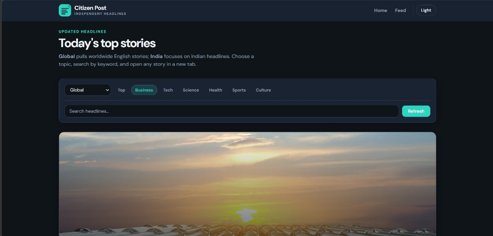
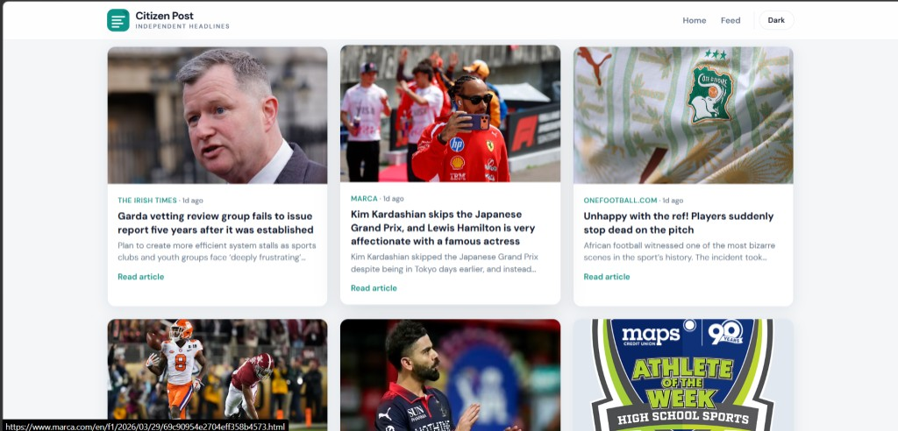

# Citizen Post

A React news reader for scanning headlines in the browser. Pick **Global** (worldwide English stories) or **India** (country-focused headlines), browse by category, search by keyword, and open full articles on the original publisher’s site. Data comes from [NewsAPI](https://newsapi.org).

---

## Screenshots

**Dark mode** — header, filters, search, and featured story area.



**Light mode** — article grid with cards, sources, and “Read article” links.



---

## Features

- **Editions:** Global and India, with category tabs (Top, Business, Tech, Science, Health, Sports, Culture).
- **Search:** Keyword search uses the NewsAPI “everything” flow so results match your query, not only the current headline list.
- **Theme:** Light and dark mode, persisted in the browser.
- **Layout:** Featured lead story plus a responsive grid of article cards with images, metadata, and excerpts.
- **Branding:** Citizen Post wordmark and simple document-style logo in the navbar.

---

## Tech stack

- [React](https://react.dev/) 18
- [Create React App](https://create-react-app.dev/) (`react-scripts`)
- Plain CSS (theme variables, no UI framework)

---

## Run locally

From the repository root:

```bash
npm install
npm start
```

Then open [http://localhost:3000](http://localhost:3000).

### Production build

```bash
npm run build
```

Static output is written to the `build/` folder.

---

## Configuration

Create a `.env` file in the project root (see `.gitignore`; never commit real keys):

```bash
REACT_APP_NEWS_API_KEY=your_newsapi_key
```

Without a key, the app may fall back to a bundled demo key, which can be rate-limited or disabled. For reliable use, register at [newsapi.org](https://newsapi.org) and use your own key.

**Note:** NewsAPI is intended primarily for server-side use. It often works on `localhost` in development; deployed sites may hit CORS limits unless you add a small backend proxy.

---

## Project layout

| Path | Purpose |
|------|---------|
| `src/components/` | UI: navbar, news page, article cards, featured story, logo |
| `src/hooks/` | Feed loading, theme |
| `src/services/` | NewsAPI client |
| `src/constants/` | Categories, regions, branding |
| `src/styles/` | Global theme tokens |
| `public/` | Static assets and `index.html` |
| `docs/screenshots/` | README preview images |

---

## Repository

Upstream copy: [github.com/singhdhairya17/Advanced_News_Application](https://github.com/singhdhairya17/Advanced_News_Application)

---

Citizen Post is built for learning and everyday reading. Respect each outlet’s terms, copyright, and the [NewsAPI](https://newsapi.org) acceptable use policy.
